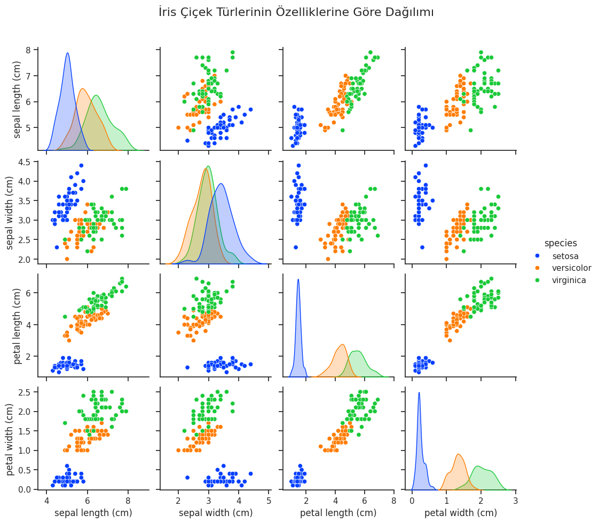

# İris Veri Seti ile K-En Yakın Komşu (KNN) Algoritması Sınıflandırma Analizi

## 1. Özet
Bu proje, makine öğrenmesi literatüründe standart bir benchmark olan İris Veri Seti üzerindeki çiçek türlerinin (Setosa, Versicolor, Virginica) fiziksel ölçümlerinden yararlanılarak K-Nearest Neighbors (KNN) algoritması ile sınıflandırılması amacıyla gerçekleştirilmiştir.

## 2. Veri Seti Bilgileri
Çalışmada kullanılan İris veri seti 3 farklı sınıfa ait toplam 150 örnek içermektedir. Her örnek için aşağıdaki 4 sürekli öznitelik (feature) ölçülmüştür:
- Çanak Yaprak Uzunluğu (Sepal Length - cm)
- Çanak Yaprak Genişliği (Sepal Width - cm)
- Taç Yaprak Uzunluğu (Petal Length - cm)
- Taç Yaprak Genişliği (Petal Width - cm)

## 3. Metodoloji ve Model Eğitimi
- **Veri Ön İşleme ve Bölme:** Veri seti %80 eğitim (train) ve %20 test (test) olarak iki bağımsız gruba ayrılmıştır.
- **Algoritma Seçimi:** Sınıflandırma modeli olarak K-Nearest Neighbors (KNN) algoritması kullanılmış, hiperparametre k değeri 3 (`n_neighbors=3`) olarak belirlenmiştir.
- **Geliştirme Ortamı:** Google Colab ve Python 3 ortamında yürütülmüştür.

## 4. Keşifçi Veri Analizi (EDA)
Seaborn kütüphanesi kullanılarak öznitelikler arası dağılımlar incelenmiştir. Analiz sonuçlarına göre:
- *Setosa* türü, özellikle taç yaprak (Petal) ölçüleri bazında diğer türlerden tamamen ayrışmaktadır.
- *Versicolor* ve *Virginica* türleri doğrusal olarak kısmen iç içe geçse de, çok değişkenli analiz ile yüksek doğrulukla ayırt edilebilmektedir.

## 5. Bulgular ve Performans Metrikleri
Test verisi (30 örnek) üzerinde yürütülen model değerlendirmesi sonucunda aşağıdaki performans metrikleri elde edilmiştir:
- **Doğruluk (Accuracy):** %100
- **Hata Matrisi (Confusion Matrix):** Test setindeki tüm sınıflar hatasız şekilde sınıflandırılmıştır (Setosa: 10/10, Versicolor: 9/9, Virginica: 11/11).

.png)

## 6. Kullanılan Teknolojiler ve Kütüphaneler
- **Programlama Dili:** Python 3
- **Veri Manipülasyonu:** Pandas, NumPy
- **Model ve Metrikler:** Scikit-Learn (`KNeighborsClassifier`, `train_test_split`, `accuracy_score`, `confusion_matrix`)
- **Görselleştirme:** Matplotlib, Seaborn

## 7. Geliştirici
**Esranur Uçal**  
Bilgisayar Programcısı
